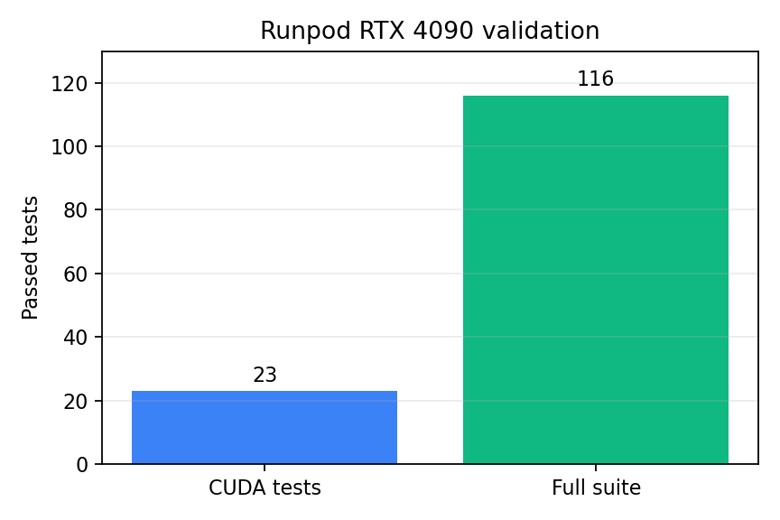
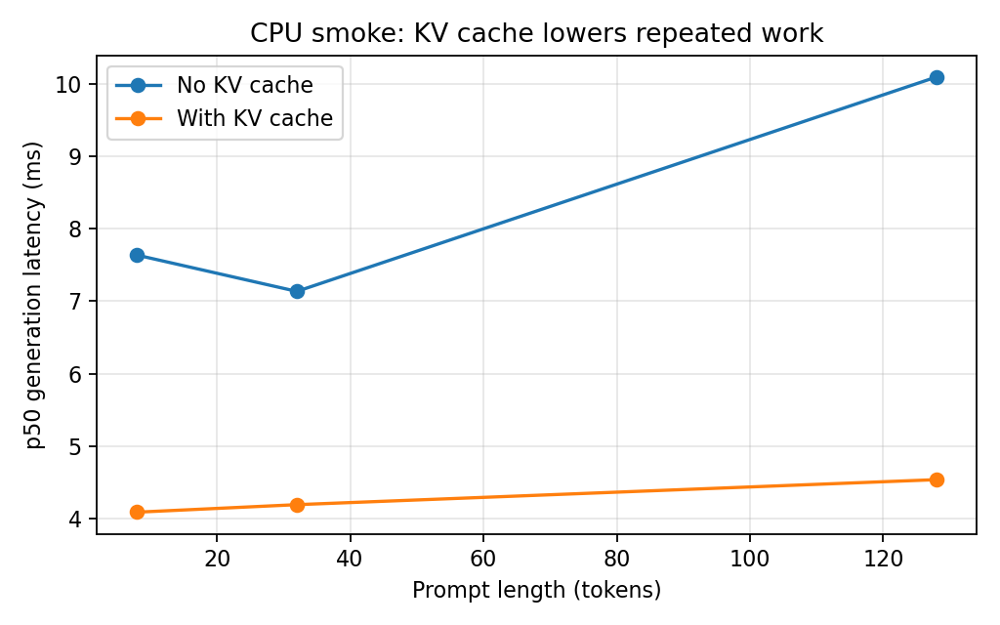
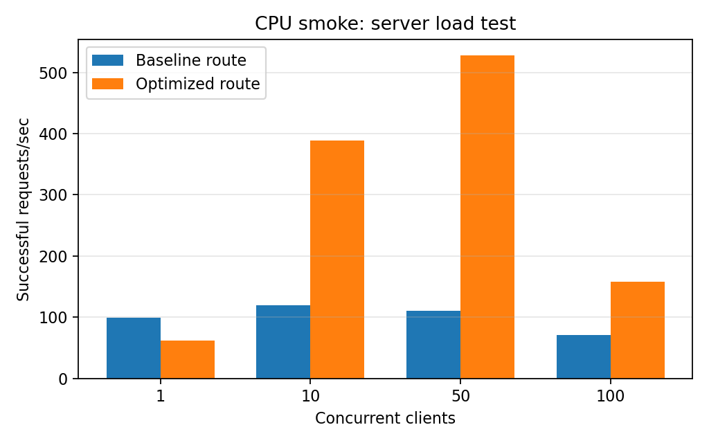

# Research Results

This file is my current research log for MiniInfer. I am separating three things:

- **Built:** code that exists in the repo.
- **Validated:** tests that passed.
- **Measured:** benchmark numbers that can support a performance claim.

That separation matters. A GPU test can prove the Triton and CUDA paths are working, but it does not automatically prove the model is faster.

## Research question

How fast can I make transformer inference if I start from a simple PyTorch loop and add real systems optimizations one by one?

The project is built around this order:

1. Measure a baseline.
2. Change one thing.
3. Measure again with the same workload.
4. Check correctness or quality.
5. Explain the result instead of just reporting a number.

## What is built now

| Version | Built piece | What I wanted to learn |
| --- | --- | --- |
| 1 | PyTorch eager baseline | How to measure TTFT, latency, tokens/sec, and memory |
| 2 | `torch.compile`, FP16/BF16, INT8/INT4 options | How precision and compilation affect speed, memory, and quality |
| 3 | RMSNorm in PyTorch, compiled PyTorch, and Triton | How a small GPU kernel is checked and timed |
| 4 | KV cache decoding and prompt-length sweep | How caching avoids recomputing the whole sequence |
| 5 | FastAPI server, queue, dynamic batcher, load tester | How batching changes throughput and latency under concurrent requests |
| 6 | PyTorch profiler and Nsight command paths | How to investigate where time goes |

## Environment checked on GPU

I verified the CUDA code on a Runpod RTX 4090.

| Item | Value |
| --- | --- |
| GPU | NVIDIA GeForce RTX 4090 |
| PyTorch | 2.8.0+cu128 |
| Triton | 3.4.0 |
| Native BF16 | Yes |
| Commit | `d9630bf585a3512c5aec7f26a103ec0f7e889e73` |

## Validation results

| Check | Result | What it means |
| --- | ---: | --- |
| CUDA-specific tests | 23 passed | Triton RMSNorm and cached CUDA generation worked on the RTX 4090 |
| Full suite | 116 passed | The whole project passed on the same Linux CUDA machine |
| Warnings | 2 | Dependency deprecation warnings from FastAPI/Starlette test tools |

The 23 CUDA tests include:

- RMSNorm Triton correctness against an FP64 oracle and PyTorch reference.
- FP32, FP16, and BF16 dtype coverage.
- Regular and irregular tensor shapes.
- Cached generation parity for small GPT-2 and Llama-style models on CUDA.

## CPU smoke benchmark

The first saved benchmark is a smoke test, not a final performance claim. It uses a tiny random GPT-2 model on CPU so the repo can be tested quickly without downloading a pretrained model.

| Metric | Value |
| --- | ---: |
| Prompt tokens | 16 |
| New tokens | 4 |
| Runs | 3 |
| Median TTFT | 1.75 ms |
| p50 generation latency | 7.25 ms |
| Output tokens/sec | 546.48 |

This tells me the benchmark pipeline works: model setup, warmup, timed generation, memory fields, and JSON output. It does not tell me how GPT-2 or TinyLlama performs on a real GPU.

## KV cache smoke result

The CPU smoke sweep compares uncached and cached decoding at prompt lengths 8, 32, and 128.

What I learned:

- Without a cache, each new token recomputes the whole growing sequence.
- With a cache, the prompt is processed once, then later steps process one new token.
- In the smoke run, cached decoding had lower p50 latency at each tested prompt length.
- The result is useful for checking the idea and the code path, but it uses a tiny random model on CPU.

## Server smoke result

The server experiment compares:

- `/baseline`: one request at a time, no KV cache.
- `/optimized`: queue plus compatible dynamic batching and KV cache.

What I learned:

- At concurrency 1, batching overhead can make the optimized route slower.
- At concurrency 10 and 50, batching improved successful requests/sec in the CPU smoke run.
- At concurrency 100, both routes slowed down because the tiny local server became overloaded.
- Server measurements include HTTP time, queue delay, and model time, so they are different from the raw model benchmark.

## What I can claim today

I can claim that I built and tested a small transformer inference systems project with:

- Baseline model benchmarking.
- Precision, compile, and quantization switches.
- Quality comparison hooks.
- A custom Triton RMSNorm kernel path.
- KV cache decoding with parity checks.
- Prompt-length sweep plots.
- A FastAPI inference server with dynamic batching.
- Load testing and profiling tools.
- CUDA validation on an RTX 4090.

I should not yet claim a real end-to-end GPU speedup, because I have not saved repeated pretrained GPU benchmark results for the baseline and optimized versions on the same workload.

## Next experiment

The next useful experiment is a real GPU benchmark table.

Use one GPU, one model, one prompt length, one output length, and one model revision. Then compare:

| Run | Model path | Goal |
| --- | --- | --- |
| FP32 eager, no cache | baseline | Starting point |
| FP16 or BF16 | precision | Check speed and memory change |
| `torch.compile` | compile | Check steady-state speed after compile |
| KV cache | cache | Check decode speed as context grows |
| Dynamic batching | server | Check throughput under concurrency |

For each run I should save:

- JSON benchmark report.
- `nvidia-smi` output.
- `pip freeze`.
- GPU name and driver version.
- Model revision.
- Exact command used.

Only after that should the README table get real speedup numbers.
